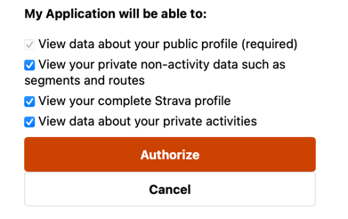
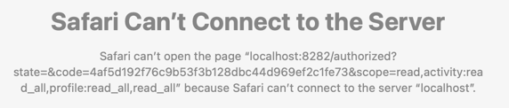

# strava

Generate interactive plots for Strava runs.

## API Access Setup

Follow instructions [here](https://developers.strava.com/docs/getting-started/) 

Refer to Step B

## Running instructions:

`python runThis.py`

`python runThis.py <rowId>`

* Terminal
  * Pass in the row number as a command-line parameter
    * i.e. 3 means the third run
    * defaults to the _most recent_ run
* File
  * Click run
  * Set `rowId` to desired value as described above

You may need to authenticate. If you choose to do so, your token will be valid for the next 6 hours. See Strava API [documentation](https://developers.strava.com/docs/reference/) for more details.

### Authentication

Ensure you have setup an API application as per the above setup instructions

If the access token is nonexistent or expired, when running the program, it will take you to a link to sign into your Strava account.

Click Authorize.

After signing in, see the following page.

Copy the text after `&code`. Paste that into the program

### credentials.txt

This file is very important.

Copy the values of Client ID and Client Secret into `CLIENT_ID` and `CLIENT_SECRET` respectively.

A template is provided to help you set it up.